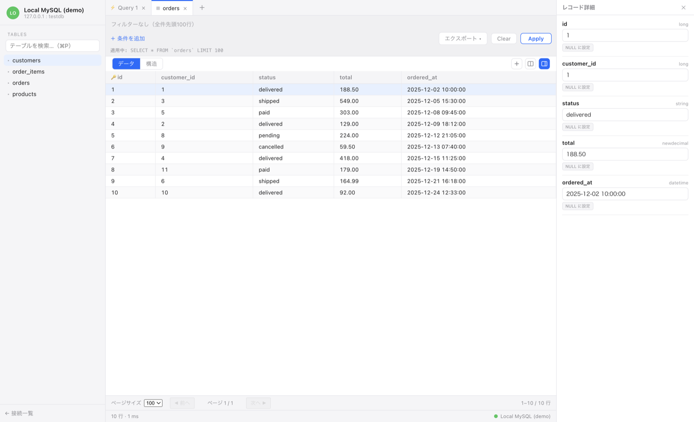
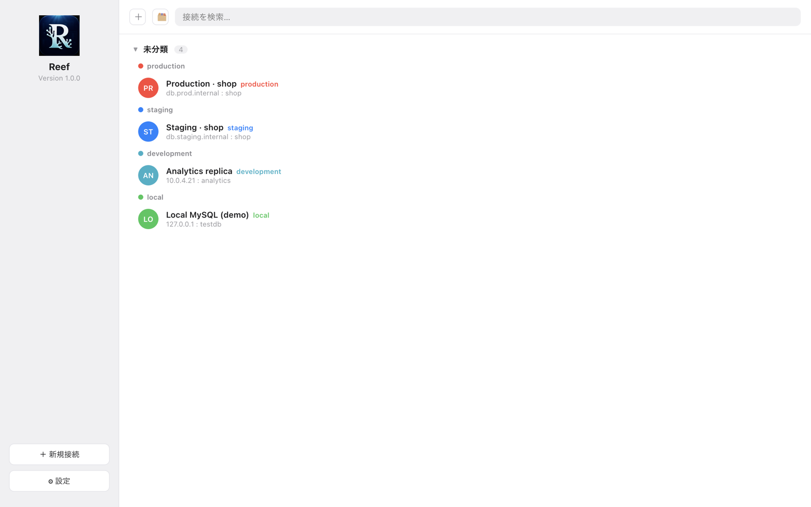
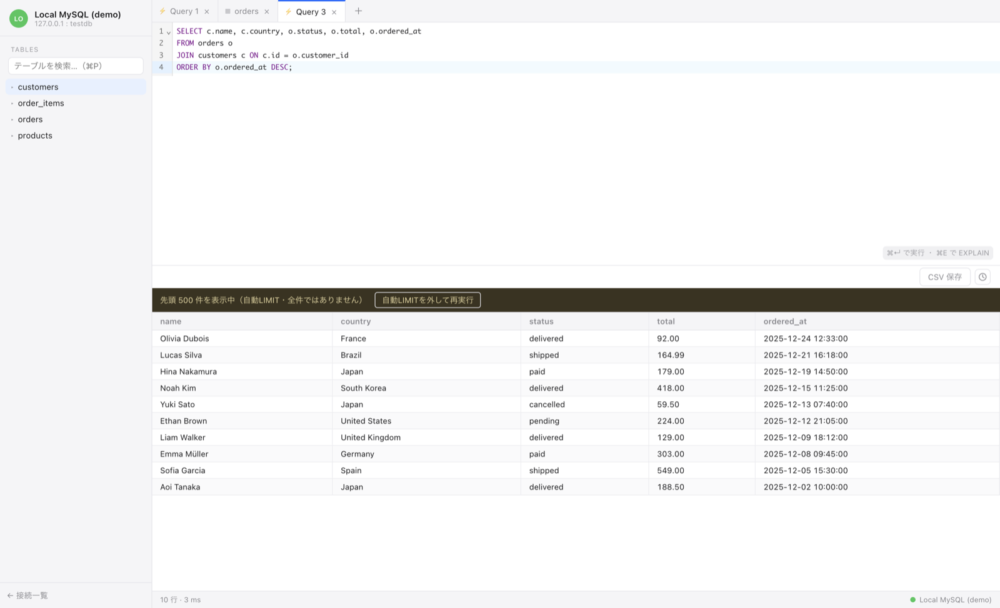

<div align="center">


# Reef

**タブ無制限の MySQL クライアント（macOS デスクトップアプリ）**

接続管理・テーブル閲覧・レコード編集・SQL 実行・ダンプ入出力を 1 つの軽量デスクトップアプリで。

[English](README.md) · [日本語](README.ja.md)

<br/>

[](https://github.com/spyder1211/reef/releases/latest)
[](LICENSE)


</div>

Reef は **Electron + React + TypeScript** で構築された軽量デスクトップアプリです。接続管理・テーブル閲覧・レコード編集・SQL 実行・ダンプの入出力までをまかなえます。

## スクリーンショット

<p align="center">
  
</p>

<table>
  <tr>
    <td width="50%"></td>
    <td width="50%"></td>
  </tr>
  <tr>
    <td align="center"><sub>環境ごとにグループ化された接続一覧</sub></td>
    <td align="center"><sub>結果グリッド付き SQL エディタ</sub></td>
  </tr>
</table>

## 主な機能

### 接続管理
- 接続プロファイルの保存（パスワードは Electron `safeStorage` で暗号化し、`userData` に保持）
- 2 階層のグループ化（ユーザー作成グループ × 環境タグ `production` / `staging` / `development` / `local` から自動導出されるサブグループ）
- ドラッグ＆ドロップによるグループ移動・並び替え
- 接続行の右クリックメニュー（複製 / 編集 / 削除）。複製は暗号化パスワード・タグ・グループ割り当てごとコピー
- 接続時にウィンドウを最大化、ウィンドウを閉じると接続一覧へ戻る

### テーブル閲覧・編集
- テーブル一覧と、名前による検索ジャンプ
- テーブル一覧の右クリックメニューから `TRUNCATE` / `DROP`
- レコードのページネーション・ソート・フィルタ（クイックフィルタ、`=` `<>` `<` `>` `contains` `in` `between` `is null` ほか）
- レコードの左右分割ビュー
- 行の詳細ペイン表示
- セル編集（`UPDATE`）、行追加（`INSERT`）、行削除（`DELETE`）
- 複数行選択 + 右クリックでバルク削除 / 複製 / コピー

### SQL エディタ
- CodeMirror ベースの SQL エディタ（SQL シンタックスハイライト）
- `Cmd+Enter` で実行。複数文（セミコロン区切り）をまとめて順次実行
- 長時間クエリの停止（専用接続で `KILL QUERY`）
- 素の `SELECT` への自動 `LIMIT` ＋ 結果行数のハード上限で、大きな結果でアプリが固まるのを防止
- 結果グリッドの行仮想化：可視範囲の行だけを描画するため、大量データでも滑らかにスクロール

### 入出力
- 結果の CSV エクスポート
- SQL ダンプのエクスポート（ストリーミング + 進捗表示）
- SQL ダンプの import / restore（`.sql` および gzip 圧縮の `.sql.gz` に対応、import 時は外部キー制約を無効化、進捗・結果サマリを表示）
- これらの操作は File メニューから実行

## 技術スタック

| 領域 | 採用技術 |
| --- | --- |
| デスクトップ基盤 | Electron 31 |
| ビルド | electron-vite / Vite 5 |
| UI | React 18 + TypeScript |
| 状態管理 | zustand |
| グリッド | @tanstack/react-table + @tanstack/react-virtual |
| SQL エディタ | @uiw/react-codemirror + @codemirror/lang-sql |
| DB ドライバ | mysql2 |
| テスト | Vitest |
| パッケージング | electron-builder（macOS dmg） |

## 動作要件

- Node.js 20 以上
- 接続先の MySQL サーバー
- 配布パッケージのビルド対象は macOS（Apple Silicon / arm64）

## セットアップ

```bash
npm install
```

### 開発

```bash
npm run dev          # electron-vite で開発起動（ホットリロード）
```

### 型チェック・テスト

```bash
npm run typecheck    # main / web 両方の tsconfig で tsc --noEmit
npm run test         # Vitest を1回実行
npm run test:watch   # Vitest をウォッチモードで実行
```

統合テストには MySQL が必要です。`docker-compose.test.yml` でテスト用の MySQL を起動できます。

```bash
docker compose -f docker-compose.test.yml up -d
```

### ビルド

```bash
npm run build        # electron-vite build（out/ に成果物）
npm run preview      # ビルド済みアプリのプレビュー
```

### macOS 向け配布パッケージ（dmg）

```bash
npm run dist:mac     # electron-vite build && electron-builder --mac --arm64
```

成果物は `dist/` に出力されます。配布物は署名なし（ad-hoc 署名）のため、`build/afterPack.cjs` でパック後にバンドル全体を ad-hoc 署名し直し、未署名配布時の「壊れている / 開けない」エラーを緩和しています。初回起動はアプリを右クリックして「開く」を選んでください。

## プロジェクト構成

```
src/
├── main/          # Electron メインプロセス
│   ├── connection/  # ConnectionManager / ProfileStore / GroupStore など
│   ├── dump/        # SQL ダンプ出力
│   ├── import/      # SQL ダンプ取り込み（gzip / statement splitter 含む）
│   ├── ipc/         # IPC ハンドラ登録
│   ├── index.ts     # エントリポイント（BrowserWindow 生成）
│   └── menu.ts      # アプリメニュー
├── preload/       # コンテキストブリッジ（window.api を公開）
├── renderer/      # React UI
│   └── src/
│       ├── home/       # 接続一覧・接続フォーム
│       ├── workspace/  # テーブル閲覧・SQL エディタ・結果グリッド
│       ├── store/      # zustand ストア
│       └── lib/        # CSV・フィルタ・検索などのユーティリティ
└── shared/        # main / preload / renderer で共有する型（types.ts）
```

IPC の戻り値は例外を投げず、`ApiResult<T>`（`{ ok: true; data } | { ok: false; error }`）の判別共用体で返す設計です（`src/shared/types.ts`）。

## リリースノート

[RELEASE_NOTES.ja.md](RELEASE_NOTES.ja.md)（[English](RELEASE_NOTES.md)）を参照してください。

## ライセンス

[MIT](LICENSE) © spyder1211
